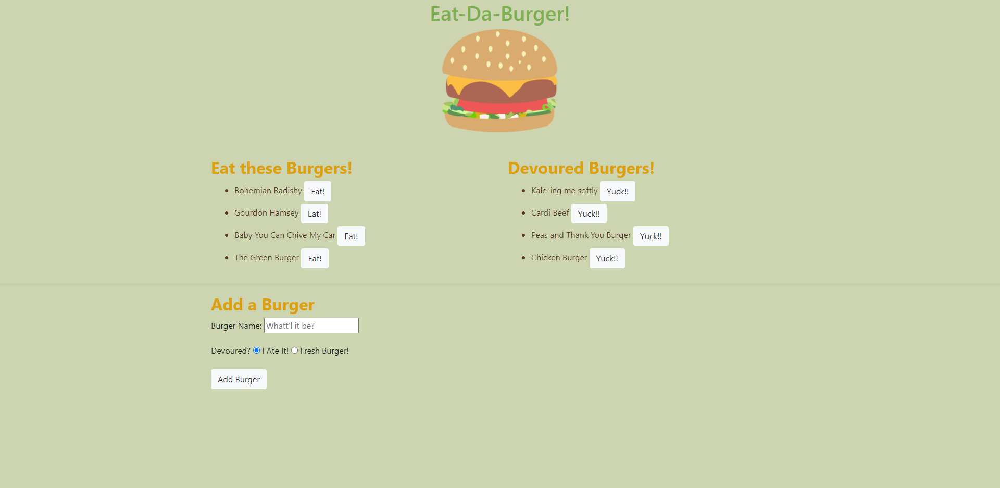

# Eat Da Burger

## Description
Eat Da Burger is a restuarant app that lets users input the names of burgers that they would like to eat!

You can view the deployed version [here](https://git.heroku.com/afternoon-reaches-38518.git)

***
## Screenshot

***
## Table of Contents
* [Installation](#installation)
* [Usage](#usage)
* [Contributors](#contributors)
* [Tests](#tests)
* [Questions](#questions)
* [License](#License)

***
## Installation
To install this project, please run an 'npm install' to install all dependencies. Once you have installed the dependencies, you will need to update your password in the config/connections folder. Please make sure to also run the schema.sql file and the seeds.sql file to run this project locally. If you are viewing this project on Heroku, feel free to use freely.

***
## Usage
It is an app that allows the user to add a burger that they'd like to eat!

***
## Contributors
Dana Corona

***
## Tests
None

***
## Questions
For questions about this project please reach out to me!

[My Github Account]('https://github.com/danacorona')

[My Email]('dana.d.corona@gmail.com')

***
## License

***
